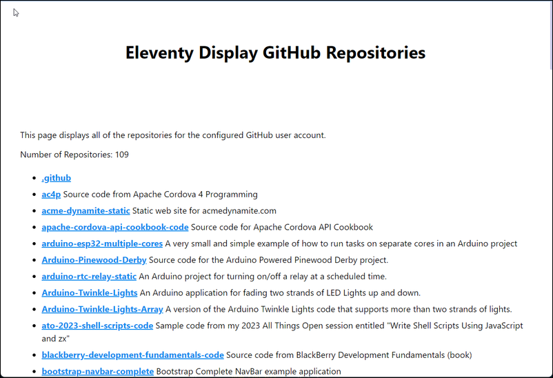

# Eleventy Display GitHub Repositories (auth)

Playing around with displaying all public repositories in my personal GitHub account in an Eleventy site.

**Note:** This repo accesses the GitHub API using an API token, skirting the rate limits issue in the other version of this project

## Demonstration

This repository includes a complete Eleventy site demonstrating the capability. To try it out, start by cloning the repository then navigate to the project's `/src/_data` folder and edit the `repos.js` file (`/src/_data/repos.js`).  In the file, look for the `githubAccount` constant declaration:

```js
const githubAccount = 'johnwargo';
```

Change the value in quotes to your GitHub account name then save your changes:

```js
const githubAccount = 'your-github-account-name';
```

Next, set an environment variable called `GITHUB_API_KEY` and store a GitBug API key in it.

Finally, open a terminal window or command prompt, navigate to the cloned project folder, and execute the following commands:

1. `npm install`
2. `eleventy --serve`

Output looks something like this:

```text
D:\dev\11ty\github-repos-sample-unauthorized>npm start

> github-test@1.0.0 start
> eleventy --serve

Fetching GitHub repositories for johnwargo
Fetching https://api.github.com/users/johnwargo/repos?per_page=100&page=1
Found 100 repos
Fetching https://api.github.com/users/johnwargo/repos?per_page=100&page=2
Found 9 repos
Fetching https://api.github.com/users/johnwargo/repos?per_page=100&page=3
[11ty] Writing _site/index.html from ./src/index.liquid
[11ty] Benchmark   1535ms  97%     1× (Data) `./src/_data/repos.js`
[11ty] Copied 3 files / Wrote 1 file in 1.57 seconds (v3.0.0-alpha.3)
[11ty] Watching…
[11ty] Server at http://localhost:8080/
```

Click the **Server** link that displays at the end of the build process and you should see something like this:



**Note:** Sample Page rendered using [MVP.css](https://andybrewer.github.io/mvp/).

## Usage

To add this capability to an Eleventy site, simply copy the modified `repos.js` file to the Eleventy project's `_data` folder. With that in place, the Eleventy site has access to a `repos` data collection you can use to render data on any page in your site.

The data collection has a lot of properties, open this URL in a browser to see them all: https://api.github.com/users/johnwargo/repos.

***

You can find information on many different topics on my [personal blog](http://www.johnwargo.com). Learn about all of my publications at [John Wargo Books](http://www.johnwargobooks.com).

If you find this code useful and feel like thanking me for providing it, please consider <a href="https://www.buymeacoffee.com/johnwargo" target="_blank">Buying Me a Coffee</a>, or making a purchase from [my Amazon Wish List](https://amzn.com/w/1WI6AAUKPT5P9).
